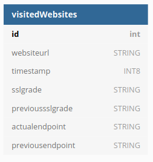
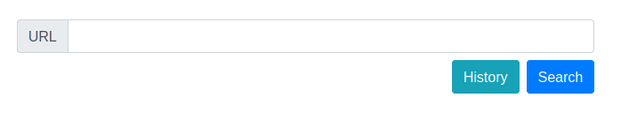

# Server Finder
In this project a service was created to obtain information about a server (given its url) and to know if the configurations have changed.

## Backend using Go
The backend was made using Go language. An API with tow endpoints was created. The first one receives a domain name and returns a json with the following information:

 - servers: array of the servers associated to the domain. Each server has:
     - address: IP of the host server.
     - ssl_grade: SSL grade rated by SSLabs.
     - country: country of the server (as using whois command).
     - owner​: organization owner of the IP (as using whois command).
 - servers_changed: true if the servers have changed compared to their state an hour or more earlier.
 - ssl_grade​: lowest grade of the servers.
 - previous_ssl_grade​: state of the servers an hour or more earlier.
 - logo: domain logo obtained from the <head> tag of the HTML.
 - title: website title obtained from the <head> tag of the HTML.
 - is_down​: true if the server is down and the information can't be obtained.

The second endpoint returns a json with the list the servers that have been searched using the first endpoint. 

Usage:

    $ go run main.go

## Database
In this project cockroachdb was used to store the information about the visited URLs.

To start the service of the database:

    $ cockroach start
        --insecure
        --store=node1
        --listen-addr=localhost:26257
        --http-addr=localhost:8080
        --join=localhost:26257,localhost:26258,localhost:26259
        --background

To access the database:

    $ cockroach sql --insecure --host=localhost:26257

The create database was called websites, it has the visitedWebsites table wich has the following structure:

The columns of the database are listed as follows:
 - websiteurl is the server that was searched to obtained its information.
 - timestamp is the unix time stamp when the search was made.
 - sslgrade is the actual ssl grade of the server.
 - previoussslgrade is the ssl grade of the server the last time that the server was searched.
 - actualendpoint is the state the server the last time that the server was searched.
 - previousendpoint is the actual state of the server.

## Frontend using Vue
Web interface that allows the user to enter the name of a domain and display in a text the json returned by the first endpoint of the service in go by pressing the button *Search*. It also allows the user to see a text with a json taht lists the domains that have been searched by pressing the button *History*.

Usage:

    $ npm run serve